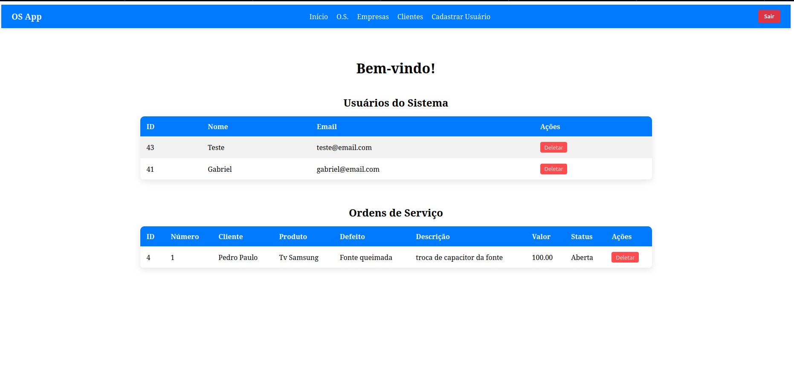

# SISTEMA DE ORDEM DE SERVIÇOS PARA EMPRESAS



Este é um sistema de gerenciamento de Ordens de Serviços (O.S.), Empresas, Clientes e Usuários, desenvolvido em **Node.js** com **Express**, **React.js** no frontend e banco de dados **PostgreSQL**. Ele permite cadastrar, listar, atualizar e deletar registros de forma segura, utilizando autenticação com **JWT**.

---

## ESTRUTURA DO PROJETO

### Backend

- `index.js`: Arquivo principal do servidor
- `docker-compose.yml`: Configuração do Docker para o banco de dados
- `middleware/auth.js`: Middleware de autenticação JWT
- `migration/init.sql`: Script de criação das tabelas no PostgreSQL
- `migration/run.sh`: Script para executar a migration
- `model/db.js`: Conexão com o banco de dados
- `model/cliente.model.js`: Model para clientes
- `model/empresa.model.js`: Model para empresas
- `model/os.model.js`: Model para ordens de serviço
- `model/user.model.js`: Model para usuários
- `routes/cliente.route.js`: Rotas de clientes
- `routes/empresa.route.js`: Rotas de empresas
- `routes/os.route.js`: Rotas de ordens de serviço
- `routes/user.route.js`: Rotas de usuários
- `user.controller.js`: Controlador de usuários

### Frontend (React)

- `src/pages`: Páginas 
- `src/components`: Componentes reutilizáveis (Navbar)

---

## STACK

- React.js
- Node.js
- Express.js
- PostgreSQL
- Docker (opcional)
- JWT para autenticação
- bcrypt para hash de senhas
- Axios para requisições HTTP
- React Router para navegação
- Context API para gerenciamento de estado global

---

## FUNCIONALIDADES

- **Usuários**: Cadastro de usuários, login e autenticação via JWT, atualização e exclusão de usuários.
- **Empresas**: Cadastro, atualização, exclusão e listagem de empresas.
- **Clientes**: Cadastro, atualização, exclusão e listagem de clientes.
- **Ordens de Serviço**: Cadastro, atualização, exclusão e listagem de O.S, associadas a empresas e usuários.

---

## INSTALAÇÃO

```bash
# Clonando o repositório
git clone https://github.com/gabrielandradecunha/os_app
cd os_app/os_api

# Copiar o arquivo de exemplo de variáveis de ambiente
cp .env.example .env

# Gerar JWT e depois inserir no .env
node -e "console.log(require('crypto').randomBytes(32).toString('hex'))"

# Iniciando o backend com Docker
sudo docker-compose up -d

# Instalando dependências
npm install

# Rodando o backend
node src/index.js

# front
cd os_app
npm install
npm run dev


